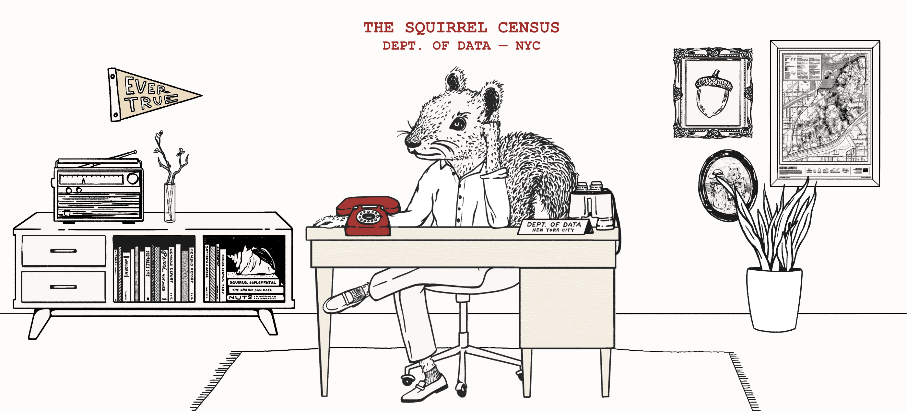
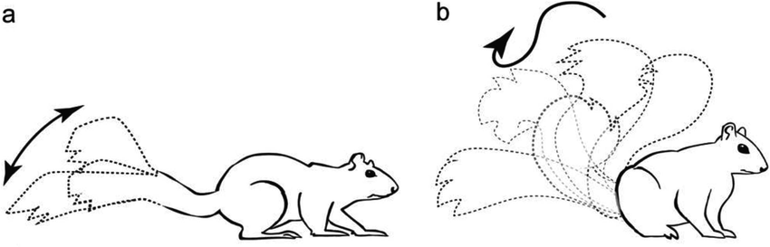

<style>
.html-widget {
    margin: auto;
}
</style>

```{r setup, include=FALSE}
knitr::opts_chunk$set(echo = TRUE, cache = TRUE)
```


image credit: https://www.thesquirrelcensus.com/

In October of 2018, volunteers recorded squirrel sightings in Central Park, New York City. They recorded attributes like approximate age and coloring as well as behaviors like vocalizations, activity, and human interactions. This report explores relationships between some of these variables.

```{r, echo=F}
suppressPackageStartupMessages({
  library(leaflet) |> suppressWarnings()
})
```

In total, 3,023 squirrel sightings were reported in Central Park. The longitude and latitude location of the each sighting was reported. These sightings are relatively well distributed throughout the park as seen in the map below.

```{r, echo=F, out.width = '100%'}
load("/home/rstudio/work/derived_data/sq_map.rda")
my_map
```

Sightings were categorized into AM and PM shifts. While sightings towards the beginning of the month was pretty steady and well matched between shifts, they taper off towards the end of the month with some days also having a larger distribution of PM sightings.

Plotting this data with temperatures for each day, acquired from historical weather data from [wunderground.com](wunderground.com), shows that sightings shift to larger proportion PM about when the temperature drops. This could be because squirrels are more likely to be active in the warmer afternoon temps on cold days. It could also be because volunteers were more active at those times. 


# Activity and Behavior Correlations
The upset plot below shows the frequency of overlapping activities and behaviors within the dataset. 

Panel A shows that most of the time squirrels were exhibiting a single action when they were sited, with the exception of eating and foraging where 251 squirrels were sighted exhibiting both actions. 200 squirrels were not exhibiting any of the listed actions. However, we do also see that some actions, like running, are more frequently observed with other behaviors.

Panel B shows that the vast majority of squirrels are not exhibiting any of the tail or vocalization behaviors listed. When the behaviors are observed, they are usually independent and tail movements are more commonly observed than vocalizations. Squirrel vocalizations are usually associated with a threat response in the wild<sup>1</sup>. While vocalizations may be less common in squirrel behavior in general, the lack of vocalizations could also be due to the urban location and squirrels more conditioned to humans and relative lack of predators.


A statistical analysis of the correlation of all activities and behaviors shows trends that would likely expect. For example, the `runs_from` behavior is negatively correlated with `indifferent`, which makese sense as we would not expect squirrels that run away from humans to also be classified as indifferent. More interestingly, the `kuks` vocalization is positivley correlated with the `quaas` vocalization. These both relate to terrestrial predator threats in the wild<sup>1</sup>.


# Eating location
When investigating the eating location preferences of the squirrels, we see that a larger percentage of squirrels (~76%) prefer to eat on the ground, compared to above ground (~70%). While this could be due to wild behaviors and foraging nuts on the ground, this preference could also be attributed to greater access to human food on the ground from litter or trash cans.


# Tail movements in response to humans

Tail twitches are generally defined as small tail movements that do not exceed a 45 degree angle. Tail flags are more fully tail movements that look like a wave motion. Tail flagging may be associated with aggression or predator response versus twitches which are thought to help communicate with other squirrels. More generally, tail flagging is thought to be a response to more severe stimulation, versus tail twitching response to milder stimulation.<sup>2</sup>

In panel A, we see that most squirrels were not exhibiting a tail movement at all. In both categories (tail movement and no tail movement), most squirrels ran away from humans rather than act indifferent or approach.

When we look at the proportion of different tail movements for each human interaction behavior, we see that squirrels exhibit a tail flagging movement more often when they are observed being indifferent or running away from humans. Tail twitching is more common in squirrels that approach humans. This could be because squirrels approaching humans don't perceive as severe a threat as squirrels that are indifferent or run away, which agrees with literature on wild behaviors.



image credit: Delgado et al 2016 <sup>2</sup>


# Color spatial autocorrelation
Three different primary fur colors were recorded in the data set (grey, black, and cinnamon). When looking at the distribution of the colors spatially, there appears to be some spatial clustering by color (squirrels of the same color look to be grouping together).

*Fur highlight colors are displayed in popups when applicable*
```{r, echo=F, out.width = '100%'}
load("/home/rstudio/work/derived_data/fur_color_map.rda")
fur_col_map
```

```{r, echo=F}
cinnamon_sp_corr_pval <- read.table("/home/rstudio/work/derived_data/cinnamon_spatial_corr_pval.txt", col.names = "pval") |> signif(3)
```
To test whether cinnamon colored squirrels are more likely to be found near eachother, I performed a Joint Count Analysis spatial autocorrelation test. The results suggest that cinnamon colored squirrels are significantly spatially autocorrelated (pval = $`r cinnamon_sp_corr_pval`$).


# References

<sup>1</sup> McRae, T. R., & Green, S. M. (2015). Gray squirrel alarm call composition differs in response to simulated aerial versus terrestrial predator attacks. Ethology Ecology & Evolution, 29(1), 54–63.

<sup>2</sup> Delgado, Mikel & Jacobs, Lucia. (2016). Inaccessibility of Reinforcement Increases Persistence and Signaling Behavior in the Fox Squirrel (Sciurus niger). Journal of comparative psychology.

